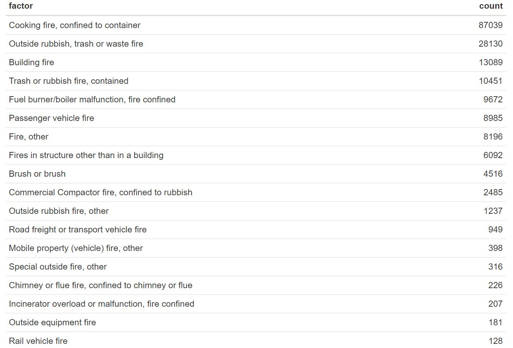

```{r setup, include=FALSE}

knitr::opts_chunk$set(echo = FALSE, message = FALSE, warning = FALSE)
library(tidyverse)
library(RSocrata)
library(plotly)
```

```{r read_data, cache = TRUE}
# load data from online source

fire_data = read.socrata("https://data.cityofnewyork.us/resource/ibte-hq4u.csv") %>%
  janitor::clean_names()

asso_sea_cause = 
  fire_data %>% 
  select(incident_date_time, incident_type_desc, 
         property_use_desc, zip_code, borough_desc) %>% 
  separate(borough_desc, sep = "- ", into = c("n", "borough")) %>% 
  select(-n) %>% 
  separate(incident_type_desc, into = c("incident_type", "incident_desc"), sep = "- ") %>%
  mutate(incident_type = str_sub(incident_type, 1, 3),
         incident_type = as.integer(incident_type)) %>% 
  mutate(month = as.factor(month.abb[as.integer(substr(incident_date_time, 6, 7))]),
         month = fct_relevel(month, "Jan", "Feb", "Mar", "Apr", "May", 
                             "Jun", "Jul", "Aug", "Sep", "Oct", "Nov", "Dec"), 
         year = str_sub(incident_date_time, 1, 4)) %>% 
  filter(zip_code != "" & zip_code != "99999" & 
         zip_code != "10691" & zip_code != "11251", 
         incident_type < 165) %>% 
  mutate(hour = str_sub(incident_date_time, 12, 13), 
         hour = as.integer(hour)) %>%
  separate(property_use_desc, sep = "- ", into = c("n", "property_use_desc")) %>% 
  select(-n)
cause_hour_plot = 
  asso_sea_cause %>% 
  group_by(hour, incident_desc) %>% 
  summarize(count = n()) %>% 
  arrange(desc(count)) %>% 
  ggplot(aes(x = hour, y = count)) +
  geom_line(aes(color = incident_desc))+ 
  theme_classic() +
  theme(legend.position = "none") +
  labs(title = "Frequency for Contributing Factors of True Fire Alarm in Each Hour",
       x = "Time",
       y = "Frequency",
       caption = "Data provided by Fire Department of New York City (FDNY)")
```
### Counts of Contributing Factors

We derive contributing factors from the "incident_type_desc" variable in the original dataset and filter out factors related to true fire alarms to make analysis more readily interpretable. And since our dataset is quite large in size, the table below only includes counts that are over 100. 



### Barplot of Contributing Factors

Also, we can make the barplot for those factor counts, which may convey information more directly.


From the plot, we can see that the most common contributing factor for true fire alarms is "cooking fire, confined to container". Its count is 3 times more than that of the second factor "outside rubbish, trash or waste fire". Despite those two, factors like "building fire" and "trash or rubbish fire, contained" are frequently reported as well.

###Major Contributing Factors in different time of the year and hour of the day

We next take the time of a year and hour of the day into account, and only consider the two most frequent contributing factors.  

We can see that in summer months, there's less fire incidents related to cooking and in winter months, there's less fire incidents related to outside rubbish. 


Hovering the mouse on different lines, it is clear that cooking fire and fire related to outside rubbish happen the most during evening, while other contributing factors seem to be evenly distributed in different hours of a day.  

```{r plotly}
ggplotly(cause_hour_plot)
```


###Property Use of fire incidents in Different Months

We found that the top two property use of ture fire alarms are multifamily dwelling and 1 or 2 family dwelling. The plot shows that in summer times, true fire incidents declines in multifamily dwelling places. 


