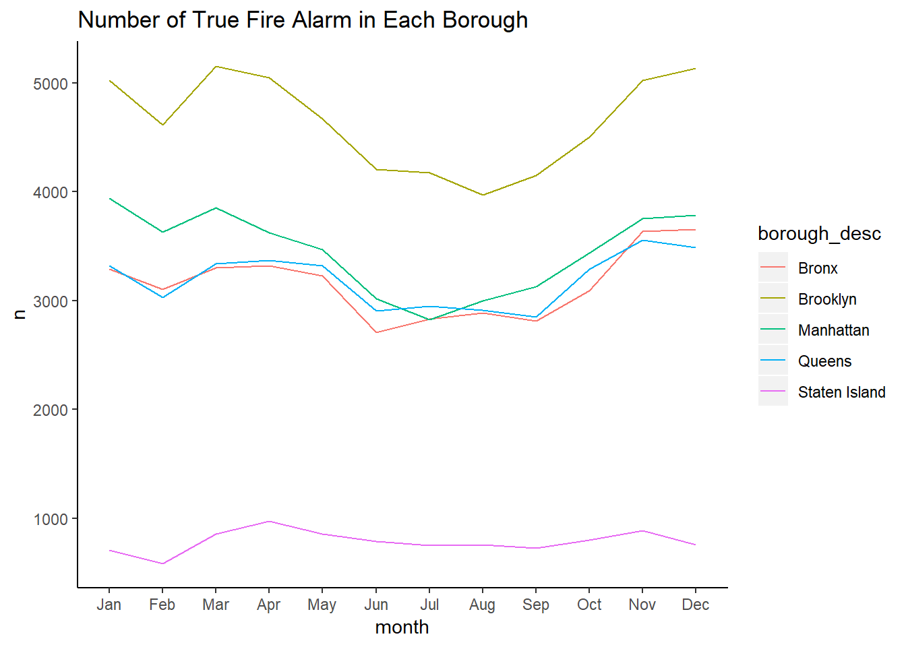

To explore the possible effects of time on the number of fire incidents, we plot two graphs to develope potential effects. The first graph is the number of fire incidents in each borough according to months. We are interested in the effect of season, and we expected that the highest number of fire incidents would be in winter due to the dry weather.

We can observe from the plot that the peak of the number of fire incidents happens from November to March. However, we spot the total number of incident decrease somewhat from December to February and it suddenly surging in March. We assume that the temperature is extremely low in February, and the fire is less likely to happen.  

Similarly, we plot a distribution of the number of fire incidents according to hours for each borough.  The plot indicates that most fire incidents happened in the afternoon.  

From visualization, we detect that the number of fire incidents varies distinctively among different hours and seasons. We decide to do a further statistical test to see if there is any relationship between season and the total number of fire incidents.

