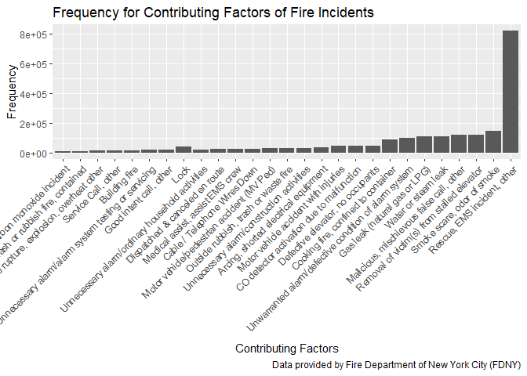

fire\_factors
================

``` r
# turn the factor variables with one level to character or integer

fire_data = read.csv(file = "./data/Incidents_Responded_to_by_Fire_Companies.csv") %>%
  janitor::clean_names() %>%
  mutate(incident_type_desc = as.character(incident_type_desc),
         incident_date_time = as.character(incident_date_time),
         arrival_date_time = as.character(arrival_date_time),
         last_unit_cleared_date_time = as.character(last_unit_cleared_date_time),
         action_taken1_desc = as.character(action_taken1_desc),
         action_taken2_desc = as.character(action_taken2_desc),
         action_taken3_desc = as.character(action_taken3_desc),
         property_use_desc = as.character(property_use_desc),
         street_highway = as.character(street_highway),
         zip_code = as.integer(zip_code),
         floor = as.integer(floor)
         )
```

``` r
# count the frequency of the specific description of incidents and plot with order

fire_factor1 = fire_data %>%
  group_by(incident_type_desc) %>%
  summarize(count = n()) %>%
  arrange(desc(count)) %>%
  ungroup() %>% 
  separate(incident_type_desc, into = c("remove", "incident_type_desc"), sep = "-") %>% 
  mutate(incident_type_desc = forcats::fct_reorder(incident_type_desc, count))
```

    ## Warning: Expected 2 pieces. Additional pieces discarded in 13 rows [19, 22,
    ## 44, 81, 82, 85, 89, 91, 108, 134, 141, 154, 178].

``` r
fire_factor1 %>%
  filter(count > 10000) %>%
  select(-remove) %>% 
  knitr::kable()
```

| incident\_type\_desc                                  |   count|
|:------------------------------------------------------|-------:|
| Rescue, EMS incident, other                           |  823378|
| Smoke scare, odor of smoke                            |  148924|
| Removal of victim(s) from stalled elevator            |  118264|
| Malicious, mischievous false call, other              |  117864|
| Water or steam leak                                   |  108893|
| Gas leak (natural gas or LPG)                         |  108362|
| Unwarranted alarm/defective condition of alarm system |  100500|
| Cooking fire, confined to container                   |   87039|
| Defective elevator, no occupants                      |   48147|
| CO detector activation due to malfunction             |   45982|
| Motor vehicle accident with injuries                  |   45057|
| Arcing, shorted electrical equipment                  |   37839|
| Unnecessary alarm/construction activities             |   31373|
| Outside rubbish, trash or waste fire                  |   28130|
| Motor vehicle/pedestrian accident (MV Ped)            |   27737|
| Cable / Telephone Wires Down                          |   24997|
| Medical assist, assist EMS crew                       |   24530|
| Dispatched & canceled en route                        |   23107|
| Lock                                                  |   22519|
| Unnecessary alarm/ordinary household activities       |   21496|
| Good intent call, other                               |   19742|
| Lock                                                  |   18456|
| Unnecessary alarm/alarm system testing or servicing   |   18426|
| Building fire                                         |   13089|
| Service Call, other                                   |   13020|
| Overpressure rupture, explosion, overheat other       |   12816|
| Trash or rubbish fire, contained                      |   10451|
| Carbon monoxide incident                              |   10203|

``` r
fire_factor1 %>%
  filter(count > 10000) %>% 
  ggplot(aes(x = incident_type_desc, y = count)) +
  geom_col() +
  theme(axis.text.x = element_text(angle = 45, hjust = 1, size = 9)) +
  labs(title = "Frequency for Contributing Factors of Fire Incidents",
       x = "Contributing Factors",
       y = "Frequency",
       caption = "Data provided by Fire Department of New York City (FDNY)")
```


