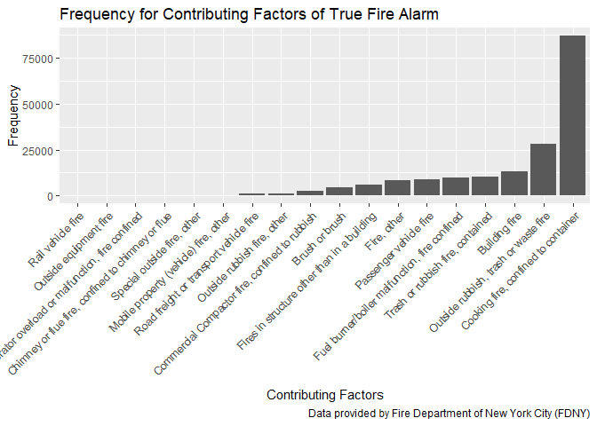

fire\_factors
================

``` r
# turn the factor variables with one level to character or integer

fire_data = read.csv(file = "./data/Incidents_Responded_to_by_Fire_Companies.csv") %>%
  janitor::clean_names() %>%
  mutate(incident_type_desc = as.character(incident_type_desc),
         incident_date_time = as.character(incident_date_time),
         arrival_date_time = as.character(arrival_date_time),
         last_unit_cleared_date_time = as.character(last_unit_cleared_date_time),
         action_taken1_desc = as.character(action_taken1_desc),
         action_taken2_desc = as.character(action_taken2_desc),
         action_taken3_desc = as.character(action_taken3_desc),
         property_use_desc = as.character(property_use_desc),
         street_highway = as.character(street_highway),
         zip_code = as.integer(zip_code),
         floor = as.integer(floor)
         )
```

``` r
# count the frequency of the specific description of incidents and plot with order

fire_factor1 = fire_data %>%
  group_by(incident_type_desc) %>%
  summarize(count = n()) %>%
  arrange(desc(count)) %>%
  ungroup() %>% 
  separate(incident_type_desc, into = c("incident_type", "incident_desc"), sep = "-") %>% 
  mutate(incident_type = as.integer(incident_type),
    incident_desc = forcats::fct_reorder(incident_desc, count))
```

    ## Warning: Expected 2 pieces. Additional pieces discarded in 13 rows [19, 22,
    ## 44, 81, 82, 85, 89, 91, 108, 134, 141, 154, 178].

    ## Warning in evalq(as.integer(incident_type), <environment>): NAs introduced
    ## by coercion

``` r
fire_factor1 %>%
  filter(count > 10000) %>%
  select(-incident_type) %>% 
  knitr::kable()
```

| incident\_desc                                        |   count|
|:------------------------------------------------------|-------:|
| Rescue, EMS incident, other                           |  823378|
| Smoke scare, odor of smoke                            |  148924|
| Removal of victim(s) from stalled elevator            |  118264|
| Malicious, mischievous false call, other              |  117864|
| Water or steam leak                                   |  108893|
| Gas leak (natural gas or LPG)                         |  108362|
| Unwarranted alarm/defective condition of alarm system |  100500|
| Cooking fire, confined to container                   |   87039|
| Defective elevator, no occupants                      |   48147|
| CO detector activation due to malfunction             |   45982|
| Motor vehicle accident with injuries                  |   45057|
| Arcing, shorted electrical equipment                  |   37839|
| Unnecessary alarm/construction activities             |   31373|
| Outside rubbish, trash or waste fire                  |   28130|
| Motor vehicle/pedestrian accident (MV Ped)            |   27737|
| Cable / Telephone Wires Down                          |   24997|
| Medical assist, assist EMS crew                       |   24530|
| Dispatched & canceled en route                        |   23107|
| Lock                                                  |   22519|
| Unnecessary alarm/ordinary household activities       |   21496|
| Good intent call, other                               |   19742|
| Lock                                                  |   18456|
| Unnecessary alarm/alarm system testing or servicing   |   18426|
| Building fire                                         |   13089|
| Service Call, other                                   |   13020|
| Overpressure rupture, explosion, overheat other       |   12816|
| Trash or rubbish fire, contained                      |   10451|
| Carbon monoxide incident                              |   10203|

``` r
fire_factor1 %>%
  filter(count > 10000) %>% 
  ggplot(aes(x = incident_desc, y = count)) +
  geom_col() +
  theme(axis.text.x = element_text(angle = 45, hjust = 1, size = 9)) +
  labs(title = "Frequency for Contributing Factors of Fire Incidents",
       x = "Contributing Factors",
       y = "Frequency",
       caption = "Data provided by Fire Department of New York City (FDNY)")
```


``` r
fire_factor1 %>%
  filter(incident_type >= 100 & incident_type <=199 | incident_type == 561) %>% 
 # filter(count > 10000) %>%
  select(-incident_type) %>% 
  knitr::kable()
```

| incident\_desc                                     |  count|
|:---------------------------------------------------|------:|
| Cooking fire, confined to container                |  87039|
| Outside rubbish, trash or waste fire               |  28130|
| Building fire                                      |  13089|
| Trash or rubbish fire, contained                   |  10451|
| Fuel burner/boiler malfunction, fire confined      |   9672|
| Passenger vehicle fire                             |   8985|
| Fire, other                                        |   8196|
| Fires in structure other than in a building        |   6092|
| Brush or brush                                     |   4516|
| Commercial Compactor fire, confined to rubbish     |   2485|
| Outside rubbish fire, other                        |   1237|
| Road freight or transport vehicle fire             |    949|
| Mobile property (vehicle) fire, other              |    398|
| Special outside fire, other                        |    316|
| Chimney or flue fire, confined to chimney or flue  |    226|
| Incinerator overload or malfunction, fire confined |    207|
| Outside equipment fire                             |    181|
| Rail vehicle fire                                  |    128|
| Dumpster or other outside trash receptacle fire    |     94|
| Natural vegetation fire, other                     |     72|
| Water vehicle fire                                 |     58|
| Forest, woods or wildland fire                     |     46|
| Grass fire                                         |     36|
| Outside storage fire                               |     33|
| Outside gas or vapor combustion explosion          |     25|
| Outside mailbox fire                               |     23|
| Off                                                |     22|
| Unauthorized burning                               |     18|
| Fire in mobile prop. used as a fixed struc., other |     17|
| Fire in portable building, fixed location          |     14|
| Construction or demolition landfill fire           |     12|
| Garbage dump or sanitary landfill fire             |      7|
| Fire in motor home, camper, recreational vehicle   |      5|
| Outside stationary compactor/compacted trash fire  |      4|
| Fire in mobile home used as fixed residence        |      3|
| Aircraft fire                                      |      3|
| Self                                               |      2|
| Cultivated vegetation, crop fire, other            |      2|
| Cultivated trees or nursery stock fire             |      2|
| Cultivated orchard or vineyard fire                |      1|

``` r
fire_factor1 %>%
  filter(incident_type >= 100 & incident_type <=199 | incident_type == 561) %>% 
  filter(count > 100) %>% 
  ggplot(aes(x = incident_desc, y = count)) +
  geom_col() +
  theme(axis.text.x = element_text(angle = 45, hjust = 1, size = 9)) +
  labs(title = "Frequency for Contributing Factors of True Fire Alarm",
       x = "Contributing Factors",
       y = "Frequency",
       caption = "Data provided by Fire Department of New York City (FDNY)")
```


