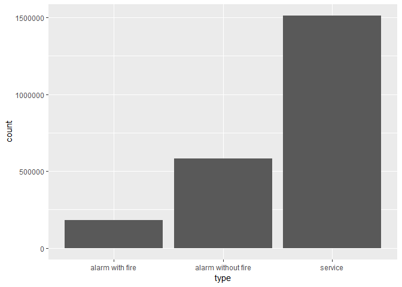
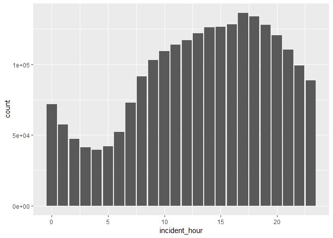

fire\_incidence\_project
================

``` r
# turn the factor variables with one level to character or integer

fire_data = read.csv(file = "data/Incidents_Responded_to_by_Fire_Companies.csv") %>%
  janitor::clean_names() %>%
  mutate(incident_type_desc = as.character(incident_type_desc),
         incident_date_time = as.character(incident_date_time),
         arrival_date_time = as.character(arrival_date_time),
         last_unit_cleared_date_time = as.character(last_unit_cleared_date_time),
         action_taken1_desc = as.character(action_taken1_desc),
         action_taken2_desc = as.character(action_taken2_desc),
         action_taken3_desc = as.character(action_taken3_desc),
         property_use_desc = as.character(property_use_desc),
         street_highway = as.character(street_highway),
         zip_code = as.integer(zip_code),
         floor = as.integer(floor)
         )
```

``` r
# count the frequency of the incidences and list top 10

fire_data %>%
  group_by(incident_type_desc) %>%
  summarize(count = n()) %>%
  arrange(desc(count)) %>%
  slice(1:10) %>%
  knitr::kable()
```

| incident\_type\_desc                                         |   count|
|:-------------------------------------------------------------|-------:|
| 300 - Rescue, EMS incident, other                            |  823378|
| 651 - Smoke scare, odor of smoke                             |  148924|
| 353 - Removal of victim(s) from stalled elevator             |  118264|
| 710 - Malicious, mischievous false call, other               |  117864|
| 522 - Water or steam leak                                    |  108893|
| 412 - Gas leak (natural gas or LPG)                          |  108362|
| 735A - Unwarranted alarm/defective condition of alarm system |  100500|
| 113 - Cooking fire, confined to container                    |   87039|
| 555 - Defective elevator, no occupants                       |   48147|
| 736 - CO detector activation due to malfunction              |   45982|

``` r
# divide the incidences to 3 types and draw the barplot

fire_data %>%
  mutate(incident_type_desc = as.integer(substr(incident_type_desc, 1, 3)),
         type = ifelse(incident_type_desc == 561 | incident_type_desc < 165, "alarm with fire",  
                ifelse((incident_type_desc-200)*(incident_type_desc-251)<=0 | (incident_type_desc-600)*(incident_type_desc-653)<=0 | (incident_type_desc-700)*(incident_type_desc-746)<=0,"alarm without fire","service"))
        ) %>%
  ggplot(aes(x = type)) + geom_bar()
```



``` r
# draw the barplot of the frequency of the incidences in each hour

fire_data %>%
  mutate(incident_hour = str_c(substr(incident_date_time, 21, 22), substr(incident_date_time, 12, 13)),
         incident_hour = ifelse(substr(incident_hour, 1, 1) == "A", as.integer(substr(incident_hour, 3, 4)) %% 12
                                , as.integer(substr(incident_hour, 3, 4)) %% 12 + 12)
         ) %>%
  group_by(incident_hour) %>%
  ggplot(aes(x = incident_hour)) + geom_bar()
```


