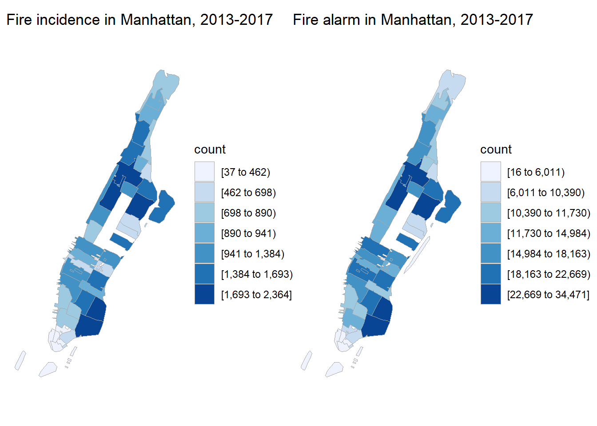
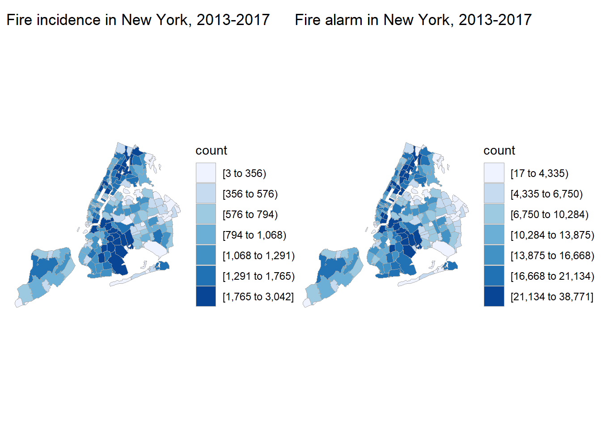

```{r setup, include=FALSE}
knitr::opts_chunk$set(include = FALSE, warning = FALSE)
library(RSocrata)
library(tidyverse)
library(choroplethrZip)
library(patchwork)
library(plotly)
```

```{r load, cache = TRUE}
with_detail = read.socrata("https://data.cityofnewyork.us/resource/ibte-hq4u.csv")
```

```{r tidy_data}
#tidy data for zip code map
dupli_with = with_detail %>% 
  select(incident_date_time, incident_type_desc, 
         property_use_desc, zip_code, borough_desc) %>% 
  separate(borough_desc, sep = "- ", into = c("n", "borough")) %>% 
  select(-n) %>% 
  separate(incident_type_desc, into = c("incident_type", "incident_desc"), sep = "- ") %>% 
  mutate(incident_type = str_sub(incident_type, 1, 3), 
         incident_type = as.integer(incident_type))

zip_map_data = 
  dupli_with %>% 
  mutate(zip_code = str_sub(zip_code, 1, 5)) %>% 
  filter(zip_code != "" & zip_code != "99999" & 
         zip_code != "10691" & zip_code != "11251") %>% 
  rename(region = zip_code) 
```

```{r map_all}
#prepare a data frame for zip code map
zip_map_data_for_map = 
  zip_map_data %>% 
  group_by(region) %>% 
  summarize(value = n())

all_alarm_ny = 
  zip_choropleth(zip_map_data_for_map,
               zip_zoom = zip_map_data_for_map$region, 
               title      = "Fire alarm in New York, 2013-2017",
               legend     = "count") + 
  coord_map()
```

```{r map_manha}
#prepare a data frame for zip code map, manhattan only
zip_map_data_for_map = 
  zip_map_data %>% 
  filter(borough == "Manhattan") %>% 
  group_by(region) %>% 
  summarize(value = n()) 

all_alarm_manha = 
  zip_choropleth(zip_map_data_for_map,
               zip_zoom = zip_map_data_for_map$region, 
               title      = "Fire alarm in Manhattan, 2013-2017",
               legend     = "count") + coord_map()
```

```{r all_borough}
zip_map_data_for_map = 
  zip_map_data %>% 
  filter(incident_type < 165) %>% 
  group_by(region) %>% 
  summarize(value = n())

fire_ny = 
zip_choropleth(zip_map_data_for_map,
               zip_zoom = zip_map_data_for_map$region, 
               title      = "Fire incidence in New York, 2013-2017",
               legend     = "count") + coord_map()
```

```{r manha_tru_fire}
zip_map_data_for_map = 
  zip_map_data %>% 
  filter(incident_type < 165, 
         borough == "Manhattan") %>% 
  group_by(region) %>% 
  summarize(value = n())

fire_manha = 
  zip_choropleth(zip_map_data_for_map,
                 zip_zoom = zip_map_data_for_map$region, 
                 title      = "Fire incidence in Manhattan, 2013-2017",
                 legend     = "count") + coord_map()
```

In order to visualize areas where fire alarms happens the most and areas where fire alarms are less likely to happen, the following maps are made. Each polygon represents a zip code area, and places with the darkest color has the most fire alarm and true fire cases.    



In manhattan, it seems fire alarms happens the most at upper west side, morningside heights, east harlem, lower east side and east villiage, regardless of the alarm type - be it a service request to the fire department or the place really caught on fire. The places in the most north part in manhattan, the most south part as well as upper east side have relatively fewer fire alarms and true fire cases.      
```{r graphs_together_manha}
fire_manha + all_alarm_manha
```



In New York City, queens seems to be a place with less fire alarms and true fire case. But if you live in Brooklyn, you'd better be more careful and avoid being caught in fire.  
```{r garphs_toge_all_ny}
fire_ny + all_alarm_ny
```

Overall, if you are trying to find a place to live in New York City where it is less likely to caught on fire, it would be a good idea to find a place in the most north part, or the financial district in Manhattan. Queens might also be a good place. 