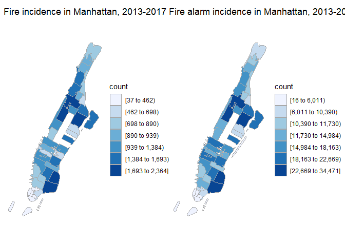
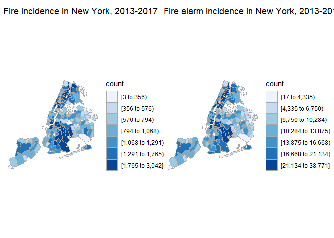

fire\_map
================

``` r
with_detail = read.socrata("https://data.cityofnewyork.us/resource/ibte-hq4u.csv")
```

``` r
#tidy data for zip code map
dupli_with = with_detail %>% 
  select(incident_date_time, incident_type_desc, 
         property_use_desc, zip_code, borough_desc) %>% 
  separate(borough_desc, sep = "- ", into = c("n", "borough")) %>% 
  select(-n) %>% 
  separate(incident_type_desc, into = c("incident_type", "incident_desc"), sep = "- ") %>% 
  mutate(incident_type = str_sub(incident_type, 1, 3), 
         incident_type = as.integer(incident_type))
```

    ## Warning: Expected 2 pieces. Additional pieces discarded in 914 rows [3472,
    ## 7257, 10510, 14519, 17735, 22456, 24900, 24904, 25203, 26583, 27950, 30180,
    ## 31089, 37530, 38893, 41521, 51384, 51596, 54277, 59991, ...].

``` r
zip_map_data = 
  dupli_with %>% 
  mutate(zip_code = str_sub(zip_code, 1, 5)) %>% 
  filter(zip_code != "" & zip_code != "99999" & 
         zip_code != "10691" & zip_code != "11251") %>% 
  rename(region = zip_code)
```

### map for all alarm causes

``` r
#prepare a data frame for zip code map
zip_map_data_for_map = 
  zip_map_data %>% 
  group_by(region) %>% 
  summarize(value = n())

all_alarm_ny = 
  zip_choropleth(zip_map_data_for_map,
               zip_zoom = zip_map_data_for_map$region, 
               title      = "Fire alarm incidence in New York, 2013-2017",
               legend     = "count") + 
  coord_map()
```

    ## Coordinate system already present. Adding new coordinate system, which will replace the existing one.

``` r
#prepare a data frame for zip code map, manhattan only
zip_map_data_for_map = 
  zip_map_data %>% 
  filter(borough == "Manhattan") %>% 
  group_by(region) %>% 
  summarize(value = n()) 

all_alarm_manha = 
  zip_choropleth(zip_map_data_for_map,
               zip_zoom = zip_map_data_for_map$region, 
               title      = "Fire alarm incidence in Manhattan, 2013-2017",
               legend     = "count") + coord_map()
```

    ## Coordinate system already present. Adding new coordinate system, which will replace the existing one.

### Map for alarms caused by fire

``` r
zip_map_data_for_map = 
  zip_map_data %>% 
  filter(incident_type < 164) %>% 
  group_by(region) %>% 
  summarize(value = n())

fire_ny = 
zip_choropleth(zip_map_data_for_map,
               zip_zoom = zip_map_data_for_map$region, 
               title      = "Fire incidence in New York, 2013-2017",
               legend     = "count") + coord_map()
```

    ## Coordinate system already present. Adding new coordinate system, which will replace the existing one.

``` r
zip_map_data_for_map = 
  zip_map_data %>% 
  filter(incident_type < 164, 
         borough == "Manhattan") %>% 
  group_by(region) %>% 
  summarize(value = n())

fire_manha = 
  zip_choropleth(zip_map_data_for_map,
                 zip_zoom = zip_map_data_for_map$region, 
                 title      = "Fire incidence in Manhattan, 2013-2017",
                 legend     = "count") + coord_map()
```

    ## Coordinate system already present. Adding new coordinate system, which will replace the existing one.

### Put graphs together

``` r
fire_manha + all_alarm_manha
```



``` r
fire_ny + all_alarm_ny
```


