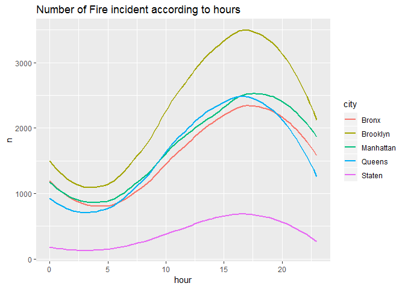

Count over time
================
Yuxin
2018年12月1日

``` r
with_detail = read.socrata("https://data.cityofnewyork.us/resource/ibte-hq4u.csv")
```

``` r
analysis = with_detail %>%
  janitor::clean_names() %>%
  separate(arrival_date_time, into = c("date", "time"), sep = " ") %>%
  separate(date, into = c("year", "month", "date"), sep = "-") %>%
  separate(time, into = c("hour", "minute", "second"), sep = ":") %>%
  separate(borough_desc, into = c("code", "city", sep = " - ")) %>%
  separate(incident_type_desc, into = c("index", "description", sep = " - ")) %>%
  mutate(year = as.integer(year), month = as.integer(month), date = as.integer(date), hour = as.integer(hour), minute = as.integer(minute), second = as.integer(second), index = as.integer(index)) %>%
  filter(index < 200 & index >99)
```

    ## Warning: Expected 3 pieces. Missing pieces filled with `NA` in 2160271
    ## rows [1, 2, 3, 4, 5, 6, 7, 8, 9, 10, 11, 12, 13, 14, 15, 16, 17, 18, 19,
    ## 20, ...].

    ## Warning: Expected 3 pieces. Additional pieces discarded in 2225151 rows [1,
    ## 2, 3, 4, 5, 6, 7, 8, 9, 10, 11, 12, 13, 14, 15, 16, 17, 18, 19, 20, ...].

    ## Warning: Expected 3 pieces. Missing pieces filled with `NA` in 72 rows
    ## [16669, 78274, 81646, 87343, 105715, 114724, 116976, 121256, 125652,
    ## 203326, 329345, 337640, 348940, 441730, 470883, 501359, 504527, 546434,
    ## 580744, 597615, ...].

    ## Warning in evalq(as.integer(index), <environment>): 强制改变过程中产生了NA

``` r
analysis_adj = analysis %>%
   mutate(month = str_replace(month, "3", "Spring"),
          month = str_replace(month, "4", "Spring"),
          month = str_replace(month, "5", "Spring"),
          month = str_replace(month, "6", "Summer"),
          month = str_replace(month, "7", "Summer"),
          month = str_replace(month, "8", "Summer"),
          month = str_replace(month, "9", "Autumn"),
          month = str_replace(month, "10", "Autumn"),
          month = str_replace(month, "11", "Autumn"),
          month = str_replace(month, "12", "Winter"),
          month = str_replace(month, "1", "Winter"),
          month = str_replace(month, "2", "Winter"),
          month = fct_relevel(month, "Spring"))
```

``` r
analysis %>%
  group_by(hour,city) %>%
  summarize(n= n()) %>%
ggplot(aes(x = hour, y = n, color = city))+
  geom_smooth(se = FALSE)+
  labs(title = "Number of Fire incident according to hours")
```

    ## `geom_smooth()` using method = 'loess' and formula 'y ~ x'

    ## Warning: Removed 5 rows containing non-finite values (stat_smooth).


