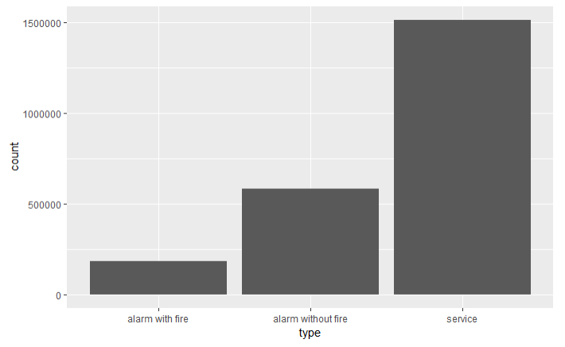
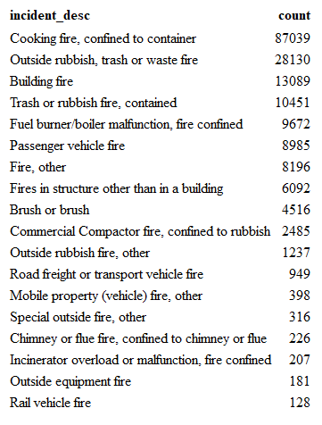
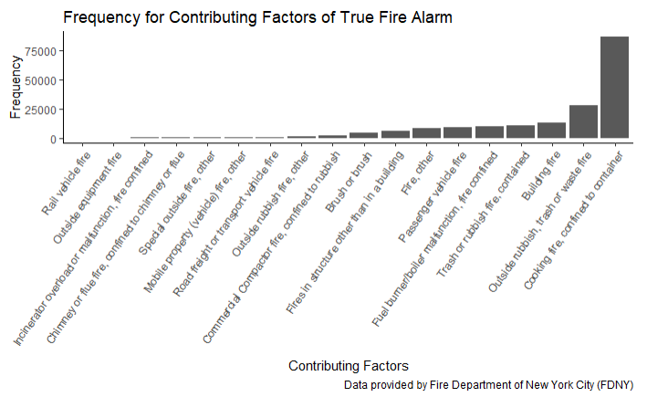

```{r setup, include=FALSE}
knitr::opts_chunk$set(echo = TRUE)
library(tidyverse)
```

Report

##Introduction

### Team members:
Jiawei Ye (jy2947), Yuxin Yang (yy2926), Ruoyu Ji (rj2543), Lingyu Zhang (lz2657)

### Motivation and related work:
Since all our team members live on campus and are disturbed by fire alarms time to time. And always, no true fire alarm happens. We began to wonder that how often do incidents like this happen in NYC.
We noticed that in the examples  drawn from submissions in the Fall of 2017, there is one called “Factors Associated with Vehicle Accidents in New York City from 2014 to 2016. This one made a great integration of techniques we have learned from Data Science class (i.e., including Shiny, linear model, interactivity and EDA).
We were inspired and finally found the available data called “Incidents Responded to by Fire Companies on NYC Open Data. The original data covers description, borough, zip code and specific time period related to certain fire incidents.

### Initial questions and evolution:
Despite variables that are directly related to fire incidents (such as incident description), we tried to explore linkages between the frequency of fire incidents and other potential causal factors.
At first, in order to see the possible effects of time on the frequency of fire incidents, we plotted the number of fire incidents in each borough according to months and hours, respectively. Then, from plots made, we saw a need to build a regression model using season as one of main predictors.
Addressing the underlying relationship between geography and frequency of fire incidents had always been our focus. Unfortunately, we only obtained the borough and the zip code information from the raw data instead of any prespecified latitude and longitude variables (which would make mapping and visualization much easier in this case). And there is not any direct shortcut establishing individual linkage between those two. However, we have overcome such a difficulty. :)
During the process of mapping, we somehow found that the population heat map was very similar to our fire cases distribution map, therefore we wanted to add the population variable to the regression model as another main predictor to see if there is some relationship between. We guess this can be an exploratory bonus!


##Methods

####Data Source 

Our main dataset is obtained from New York City open data website in this [link]( https://data.cityofnewyork.us/Public-Safety/Incidents-Responded-to-by-Fire-Companies/tm6d-hbzd). Although you can download the file, we suggest you not to - it is too big to be fully displayed in excel. Instead you can use the following the code to access the data. Depending on the speed of the computer, the time needed to load the data can take 2 - 30 minutes. 

```{r load, cache = TRUE}
library(RSocrata)
with_detail = read.socrata("https://data.cityofnewyork.us/resource/ibte-hq4u.csv")
```

Another data source, the estimated population in each zip code area in New York City in 2012 is provided by the package  `choroplethrZip`. The author of the package claims he obtained the estimated population data from American Community Survey (ACS). We use the following code to easily get a cleaned data frame of population by zip code area in the United States.  

```{r zip_data}
devtools::install_github('arilamstein/choroplethrZip@v1.3.0')
library(choroplethrZip)
data("df_pop_zip")
```
	
####Cleaning

Despite the comprehensive information offered by the data set, we only selected a few variables of interest.  They are:  

* `incident_date_time`: the time an incident happened

* `incident_type_desc`: the description of an incident's type

* `property_use_desc`: property use of an fire alarm incident

* `zip_code`: the zip code where the incident happened

* `borough_desc`: the borouogh in which the incident happened

We broke down the `incident_date_time` variable to obtain the year, month and hour when an incident happened, and further created a `season` variable by month. 

We broke down the `incident_type_desc` variable to obtain a three-digits code for each description of the incident, and a character variable for the description. The descriptions were classified as "fire alarm with fire", "fire alarm without fire" and "service request" according to the descriptions. 

We broke down the `borough_desc` variable to obtain a character variable with the boroughs' name. 

The code we used were:

```{r data_clean, warning=FALSE}
fire_data = with_detail %>% 
  select(incident_date_time, incident_type_desc, zip_code, borough_desc) %>% 
  separate(incident_type_desc, into = c("incident_type", "incident_desc"), sep = "-") %>% 
  mutate(incident_type = as.integer(str_sub(incident_type, 1, 3)), 
         type = ifelse(incident_type < 165, "alarm with fire",  
                ifelse((incident_type-200)*(incident_type-251)<=0 |   
                       (incident_type-600)*(incident_type-653)<=0 | 
                       (incident_type-700)*(incident_type-746)<=0, "alarm without fire", "service")),
         city = substr(borough_desc, 5, 20),
         hour = substr(incident_date_time, 12, 13),
         month = as.integer(substr(incident_date_time, 6, 7)),
         month_origin = month,
         month = str_replace(month, "3", "Spring"),
         month = str_replace(month, "4", "Spring"),
         month = str_replace(month, "5", "Spring"),
         month = str_replace(month, "6", "Summer"),
         month = str_replace(month, "7", "Summer"),
         month = str_replace(month, "8", "Summer"),
         month = str_replace(month, "9", "Autumn"),
         month = str_replace(month, "10", "Autumn"),
         month = str_replace(month, "11", "Autumn"),
         month = str_replace(month, "12", "Winter"),
         month = str_replace(month, "1", "Winter"),
         month = str_replace(month, "2", "Winter"),
         month = fct_relevel(month, "Spring"))
```

For the dataset containing the population in each zip code area in the US, we used the following code to obtain the population only in New York City. 

####Exploratory data analysis

We first addressed our initial interest, which was how many fire alarms without fire happened in New York City. A bar plot and a table displaying the most frequent causes of alarms were created using the following code. 

```{r frequency_analysis}
fire_data %>%
  group_by(incident_desc) %>%
  summarize(count = n()) %>%
  arrange(desc(count)) %>%
  slice(1:10) %>%
  knitr::kable()

ggplot(data = fire_data, aes(x = type)) + geom_bar()
```

We changed our focus to true fire incidents since we thought it is more meaningful to explore life-threatening scenario. 

We explored effect of time on the number of true fire incidents and created plots for the number of true fire incidents in each hour and each month using the following code: 

```{r hour_month_plot}
true_fire_month = fire_data %>%
  filter(incident_type < 165) %>%
  mutate(month_origin = as.factor(month.abb[month_origin]),
         month_origin = fct_relevel(month_origin, "Jan", "Feb", "Mar", "Apr", "May", "Jun", "Jul", "Aug", "Sep", "Oct", "Nov", "Dec"),
         borough_desc = substr(borough_desc, 5, 20)) %>%
  group_by(borough_desc, month_origin) %>%
  summarize(n = n())

ggplot(true_fire_month, aes(x = month_origin, y = n, color = borough_desc, group = borough_desc)) + 
    geom_line() +
    labs(title = "Number of True Fire Alarm in Each Borough") +
    theme(panel.grid.major = element_blank(), 
          panel.grid.minor = element_blank(),
          panel.background = element_blank(), 
          axis.line = element_line(colour = "black"))

true_fire_hour = fire_data %>%
  group_by(hour, city) %>%
  summarize(n = n())

ggplot(data = true_fire_hour, aes(x = hour, y = n, color = city, group = city)) +
  geom_line() +
  labs(title = "Number of Fire incident according to hours") +
    theme(panel.grid.major = element_blank(), 
          panel.grid.minor = element_blank(),
          panel.background = element_blank(), 
          axis.line = element_line(colour = "black"))
```

We next explored the most frequent contributing factors of true fire using the following code: 

```{r fire_factor, warning = FALSE}
fire_factor = with_detail %>%
  group_by(incident_type_desc) %>%
  summarize(count = n()) %>%
  arrange(desc(count)) %>%
  ungroup() %>% 
  separate(incident_type_desc, into = c("incident_type", "incident_desc"), sep = "-") %>% 
  mutate(incident_type = str_sub(incident_type, 1, 3), 
         incident_type = as.integer(incident_type),
    incident_desc = forcats::fct_reorder(incident_desc, count))

fire_factor %>%
  filter(incident_type >= 100 & incident_type <=199) %>% 
  filter(count > 100) %>%
  select(-incident_type) %>% 
  knitr::kable()

fire_factor %>%
  filter(incident_type >= 100 & incident_type <=199) %>% 
  filter(count > 100) %>% 
  ggplot(aes(x = incident_desc, y = count)) +
  geom_col() +
  theme_classic() +
  theme(axis.text.x = element_text(angle = 55, hjust = 1, size = 9)) +
  labs(title = "Frequency for Contributing Factors of True Fire Alarm",
       x = "Contributing Factors",
       y = "Frequency",
       caption = "Data provided by Fire Department of New York City (FDNY)")
```

We were also interested in the distribution of true fire incidents in different area. We found a package called `zipcode` which has longitude and latitude coordinates of each zip code, and tried to plot every fire alarm cases on the map by adding random numbers to each fire alarm cases using the following code: 

```{r zip_coordinate}
library(zipcode)

data("zipcode")
zipcode = zipcode %>% 
  rename(zip_code = zip)

with_cor = left_join(with_detail, zipcode, by = "zip_code") %>%
  filter(borough_desc == "1 - Manhattan"& zip_code != "" & zip_code != "99999" & 
         zip_code != "10691" & zip_code != "11251")

with_cor %>% 
  mutate(latitude = latitude +  0.0015 * rnorm(558611, 0, 1),
         longitude = longitude +  0.0015 * rnorm(558611, 0, 1)) %>% 
  group_by(zip_code) %>% 
  mutate(count_in_zip = n()) %>%
  ggplot(aes(x = longitude, y = latitude)) +
  geom_point(aes(color = count_in_zip), size = 0.015) +
  theme_bw()
```

But the map does not look good and real. So we searched for other available methods for maps and found another package called `choroplethrZip`. Heat maps were then created using following code: 

```{r zip_map}
zip_map_data = 
  fire_data %>% 
  mutate(zip_code = str_sub(zip_code, 1, 5)) %>% 
  filter(zip_code != "" & zip_code != "99999" & 
         zip_code != "10691" & zip_code != "11251") %>% 
  rename(region = zip_code) 

zip_map_data_for_map = 
  zip_map_data %>% 
  filter(incident_type < 165) %>% 
  group_by(region) %>% 
  summarize(value = n())

zip_choropleth(zip_map_data_for_map,
               zip_zoom = zip_map_data_for_map$region, 
               title      = "Fire incidence in New York, 2013-2017",
               legend     = "count") + coord_map()
```

	
#####Visualization
Apart from the visualization methods described above, we made a shiny dashboard to visualize the distribution of true fire cases in different season, time of a day, and borough. The link of it is https://lz2657.shinyapps.io/shiny/

####Statistical analysis
We build a regression model on the number of true fire incidents against the population and season in each zip code area. Population was considered as a continuous variable and season as a categorical variable. Summer was used as the reference variable since exploratory analysis showed there's less fire in summer than in other seasons. 

```{r regression, warning = FALSE}
reg_prep = 
  with_detail %>% 
  select(incident_date_time, incident_type_desc, 
         property_use_desc, zip_code, borough_desc) %>% 
  #get a clean borough variable
  separate(borough_desc, sep = "- ", into = c("n", "borough")) %>% 
  select(-n) %>% 
  #make it easier to filter true fire alarms
  separate(incident_type_desc, into = c("incident_type", "incident_desc"), sep = "- ") %>%
  mutate(incident_type = str_sub(incident_type, 1, 3),
         incident_type = as.integer(incident_type)) %>% 
  #clean year and month
  mutate(month = as.factor(month.abb[as.integer(substr(incident_date_time, 6, 7))]),
         month = fct_relevel(month, "Jan", "Feb", "Mar", "Apr", "May", 
                             "Jun", "Jul", "Aug", "Sep", "Oct", "Nov", "Dec"), 
         year = str_sub(incident_date_time, 1, 4)) %>% 
  #get a season variable. I can't believe I'm using this ugly if_else
  mutate(season = 
           if_else(month %in% c("Dec", "Jan", "Feb"), "winter", 
                   if_else(month %in% c("Mar", "Apr", "May"), "spring", 
                           if_else(month %in% c("Jun", "Jul", "Aug"), "summer", "autumn"))), 
         season = as.factor(season), 
         season = fct_relevel(season, c("summer", "autumn", "spring", "winter"))) %>% 
  #clean zip code, exclude unreasonable zip codes
  mutate(zip_code = str_sub(zip_code, 1, 5)) %>% 
  filter(zip_code != "" & zip_code != "99999" & 
         zip_code != "10691" & zip_code != "11251", 
         incident_type < 165, 
         year == "2013") %>% 
  group_by(zip_code, season) %>% 
  summarize(true_fire = n())

##pull population data from the choroplethrZip package
data("df_pop_zip")
pop_in_ny = 
  df_pop_zip %>% 
  rename(zip_code = region, 
         population = value)

reg_data = left_join(reg_prep, pop_in_ny, by = "zip_code")

fit = lm(true_fire ~ population + season, data = reg_data)
broom::tidy(fit) %>% 
  knitr::kable(digits = 3)
```

##Results
* We found that medical services is the most frequent reason of fire alarms.


* We found that alarms with fire is much less than services requested and alarms without fire. 


* We found that most true fire incidents happened in the afternoon and there's a peak around dinner time.  


* We found that highest number of fire incidents happen from November to March. The total number of incidents had a decreasing trend from December to February but suddenly surged in March. 


* We found that the most frequent cause of true fire incidents is cooking, followed by outdoor rubbish fire. 




* We found that in Manhattan, fire alarms happens the most at upper west side, morningside heights, east harlem, lower east side and east village, regardless of whether there's really fire. While inwood, tribeca and upper east side have relatively fewer fire alarms and true fire cases.


* We found that in New York City, Queens seems to be a place with less fire alarms and true fire cases while Brooklyn has the most.


* We found that the number of true fire incidences had highly significant positive association with population, and in summer there was an average of 8 less true fire cases than in other seasons. 


##Conclusion
We find that the fire incident numbers are primarily related with population and season in New York City. This conclusion is precisely what we expected. Our inference on the relationship between climate and total fire incidents number is based on the assumption that change climate or the temperature not changing with respect to month.  However, this is not accurate for that the temperature varies distinctively in one month. If we make more profound mining into the dataset, we can combine our data with climate data to develop a more factual result concerning the relationship.

##Discussion
##Acknowledgements
We thank ourselves for finishing everything.  

We thank Prof Jin for delaying the due date of homework 10 to Dec. 10. 

We thank Ari Lamstein for developing the package `choroplethrZip` so that we can create maps using zip code. 
